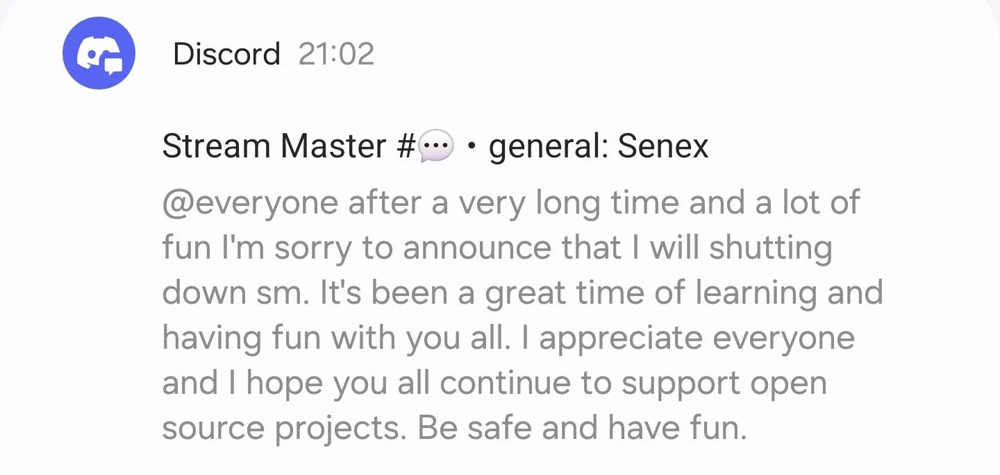

> **NOTICE**: This repository is a decoupled fork from /SenexCrenshaw/StreamMaster, created after the upstream source code was revoked.

## Update 2: 2025-02-12:

I've managed to get a build working, where you can find a release at `ghcr.io/carlreid/streammaster:latest` ([view it here](https://github.com/carlreid/StreamMaster/pkgs/container/streammaster)).

As such, replace your exiting `senexcrenshaw/streammaster` reference to `ghcr.io/carlreid/streammaster`. This is of course then built from the source code in this repository.

I have no idea how far behind or not the code is in this repo, though the UI states version `0.17.9` in the bottom left.

## Update 1: 2025-02-12:

It seems that everything relating to StreamMaster has mysteriously vanished. I have no idea, however [a Reddit thread](https://www.reddit.com/r/PleX/comments/1indw17/streammaster_no_longer_available/) has some discussion on it.

`/u/EFletch79` managed to grab the following Discord message:  

Those looking for an alternative could check out [Threadfin](https://github.com/Threadfin/Threadfin).

---

## Original README

    
    <H1 align="center" width="100%">Welcome to StreamMaster</H1>

StreamMaster, the premier video proxy streaming platform.

Please go to the wiki for further details and installation instructions.
[New docs](https://carlreid.github.io/StreamMaster/)

Old Docs
[Stream Master Wiki](https://github.com/carlreid/StreamMaster/wiki)

## Features

- **Import any number of M3U and EPG files:** With StreamMaster, you can easily import any number of M3U and EPG files by URL or file with auto refresh, giving you access to a vast array of streaming content.

- **Customizable logos:** StreamMaster allows you to customize your logos with cached logos for quick access and tv-logos support from local directories, so you can create a unique and professional-looking streaming experience.

- **Stream analytics and statistics:** With StreamMaster's powerful analytics and statistics tools, you can track your streaming performance and gain valuable insights.

- **Virtual HDHomeRuns:** StreamMaster lets you create as many virtual HDHomeRuns as you like, each with its own streaming setup, so you can easily manage and organize your streaming content.

- **Integration with popular streaming tools and platforms:** StreamMaster seamlessly integrates with popular streaming tools and platforms like Plex and Emby.

- **Built with the latest React and C# core:** StreamMaster is built with the latest React and C# core technologies, ensuring a fast and reliable streaming experience across a multitude of operating systems and platforms.

- **Robust proxying:** Using the StreamMaster built in proxy enables robust logging and reliability. Extended channels can be created to use as fail over streams. Everything is done in RAM using the latest memory handling techniques.

- **Multiple clients for the same backend connection:** StreamMaster will not start a new backend stream if it is already proxing the same one. Multiple clients can watch the same channel with just one backend active stream.

- **And much more!** With new features and updates being added all the time, StreamMaster is constantly evolving to meet the needs of today's streamers and content creators.

Docker Repo: [Stream Master Docker IO](https://github.com/carlreid/StreamMaster/pkgs/container/streammaster)
